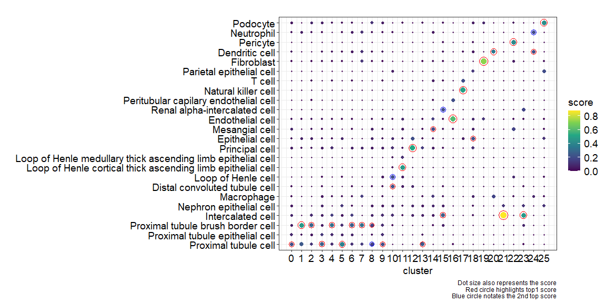
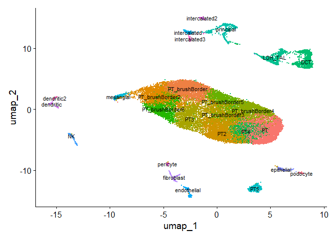
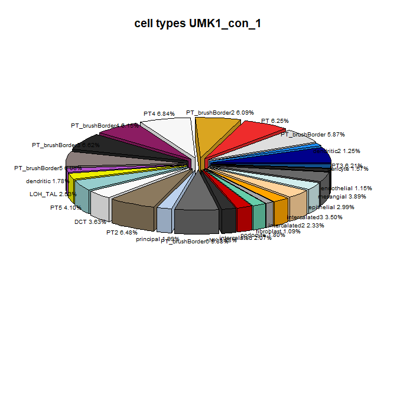
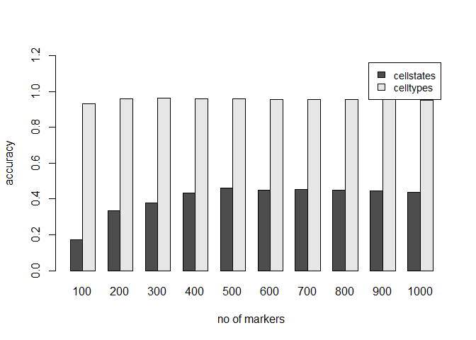
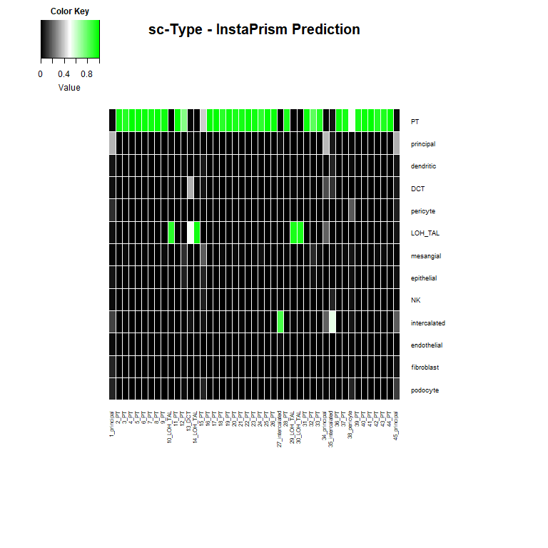

# scBulk
code and data for deconvolution of kidney and brain organoid trancriptome data

## Seurat analysis of sc-RNAseq kidney dataset GSE202109

Load libraries

``` r
library(Seurat)
library(gplots)
library(scMayoMap)
library(ggplot2)
library(svglite)
library(preprocessCore)
library(sva)
library(InstaPrism)
library(plotrix)
```

Get matrix, barcode and features .gz files of all samples (except the
CD45) from NCBI GEO **GSE202109** , matrix files:
GSM6094655_HKB14_matrix.mtx.gz, GSM6094658_HKB17_matrix.mtx.gz,
GSM6094668_HKB32_matrix.mtx.gz GSM6094656_HKB15_matrix.mtx.gz,
GSM6094659_HKB18_matrix.mtx.gz, GSM6094669_HKB33_matrix.mtx.gz
GSM6094657_HKB16_matrix.mtx.gz, GSM6094667_HKB31_matrix.mtx.gz,
GSM6094670_HKB34_matrix.mtx.gz and corresponding barcodes and features
files. Go to the directory where you downloaded the files.

``` r
setwd("D:/seurat/GSE202109") # replace with your working directory
expression_matrix <- ReadMtx( # M35
  mtx = "GSM6094655_HKB14_matrix.mtx.gz", features = "GSM6094655_HKB14_features.tsv.gz",
  cells = "GSM6094655_HKB14_barcodes.tsv.gz"
)
seurat_R1 <- CreateSeuratObject(counts = expression_matrix)
DefaultAssay(seurat_R1) <- "RNA"
seurat_R1[["percent.mt"]] <- PercentageFeatureSet(seurat_R1, pattern = "^MT-")
seurat_R1 <- subset(seurat_R1, subset = nFeature_RNA > 200 & percent.mt < 50)

expression_matrix <- ReadMtx( # M65
  mtx = "GSM6094656_HKB15_matrix.mtx.gz", features = "GSM6094656_HKB15_features.tsv.gz",
  cells = "GSM6094656_HKB15_barcodes.tsv.gz"
)
seurat_R2 <- CreateSeuratObject(counts = expression_matrix)
DefaultAssay(seurat_R2) <- "RNA"
seurat_R2[["percent.mt"]] <- PercentageFeatureSet(seurat_R2, pattern = "^MT-")
seurat_R2 <- subset(seurat_R2, subset = nFeature_RNA > 200 & percent.mt < 50)

expression_matrix <- ReadMtx(
  mtx = "GSM6094657_HKB16_matrix.mtx.gz", features = "GSM6094657_HKB16_features.tsv.gz",
  cells = "GSM6094657_HKB16_barcodes.tsv.gz"
)
seurat_R3 <- CreateSeuratObject(counts = expression_matrix)
DefaultAssay(seurat_R3) <- "RNA"
seurat_R3[["percent.mt"]] <- PercentageFeatureSet(seurat_R3, pattern = "^MT-")
seurat_R3 <- subset(seurat_R3, subset = nFeature_RNA > 200 & percent.mt < 50)

expression_matrix <- ReadMtx(
  mtx = "GSM6094658_HKB17_matrix.mtx.gz", features = "GSM6094658_HKB17_features.tsv.gz",
  cells = "GSM6094658_HKB17_barcodes.tsv.gz"
)
seurat_R4 <- CreateSeuratObject(counts = expression_matrix)
DefaultAssay(seurat_R4) <- "RNA"
seurat_R4[["percent.mt"]] <- PercentageFeatureSet(seurat_R4, pattern = "^MT-")
seurat_R4 <- subset(seurat_R4, subset = nFeature_RNA > 200 & percent.mt < 50)

expression_matrix <- ReadMtx( # F64
  mtx = "GSM6094659_HKB18_matrix.mtx.gz", features = "GSM6094659_HKB18_features.tsv.gz",
  cells = "GSM6094659_HKB18_barcodes.tsv.gz"
)
seurat_R5 <- CreateSeuratObject(counts = expression_matrix)
DefaultAssay(seurat_R5) <- "RNA"
seurat_R5[["percent.mt"]] <- PercentageFeatureSet(seurat_R5, pattern = "^MT-")
seurat_R5 <- subset(seurat_R5, subset = nFeature_RNA > 200 & percent.mt < 50)

expression_matrix <- ReadMtx( # F50
  mtx = "GSM6094667_HKB31_matrix.mtx.gz", features = "GSM6094667_HKB31_features.tsv.gz",
  cells = "GSM6094667_HKB31_barcodes.tsv.gz"
)
seurat_R6 <- CreateSeuratObject(counts = expression_matrix)
DefaultAssay(seurat_R6) <- "RNA"
seurat_R6[["percent.mt"]] <- PercentageFeatureSet(seurat_R6, pattern = "^MT-")
seurat_R6 <- subset(seurat_R6, subset = nFeature_RNA > 200 & percent.mt < 50)

expression_matrix <- ReadMtx(
  mtx = "GSM6094668_HKB32_matrix.mtx.gz", features = "GSM6094668_HKB32_features.tsv.gz",
  cells = "GSM6094668_HKB32_barcodes.tsv.gz"
)
seurat_R7 <- CreateSeuratObject(counts = expression_matrix)
DefaultAssay(seurat_R7) <- "RNA"
seurat_R7[["percent.mt"]] <- PercentageFeatureSet(seurat_R7, pattern = "^MT-")
seurat_R7 <- subset(seurat_R7, subset = nFeature_RNA > 200 & percent.mt < 50)

expression_matrix <- ReadMtx(
  mtx = "GSM6094669_HKB33_matrix.mtx.gz", features = "GSM6094669_HKB33_features.tsv.gz",
  cells = "GSM6094669_HKB33_barcodes.tsv.gz"
)
seurat_R8 <- CreateSeuratObject(counts = expression_matrix)
DefaultAssay(seurat_R8) <- "RNA"
seurat_R8[["percent.mt"]] <- PercentageFeatureSet(seurat_R8, pattern = "^MT-")
seurat_R8 <- subset(seurat_R8, subset = nFeature_RNA > 200 & percent.mt < 50)

expression_matrix <- ReadMtx(
  mtx = "GSM6094670_HKB34_matrix.mtx.gz", features = "GSM6094670_HKB34_features.tsv.gz",
  cells = "GSM6094670_HKB34_barcodes.tsv.gz"
)
seurat_R9 <- CreateSeuratObject(counts = expression_matrix)
DefaultAssay(seurat_R9) <- "RNA"
seurat_R9[["percent.mt"]] <- PercentageFeatureSet(seurat_R9, pattern = "^MT-")
seurat_R9 <- subset(seurat_R9, subset = nFeature_RNA > 200 & percent.mt < 50)
rm(expression_matrix)
gc()
```

    ##             used  (Mb) gc trigger   (Mb)  max used   (Mb)
    ## Ncells   7151489 382.0   13554787  724.0  13554787  724.0
    ## Vcells 101492249 774.4  274056140 2090.9 274041335 2090.8

``` r
slist=list(seurat_R1,seurat_R2,seurat_R3,seurat_R4,seurat_R5,seurat_R6,seurat_R7,seurat_R8,seurat_R9)
```

Seurat analysis: normalize and identify variable features for each
dataset independently

``` r
slist <- lapply(X = slist, FUN = function(x) {
    x <- NormalizeData(x)
    x <- FindVariableFeatures(x, selection.method = "vst", nfeatures = 2000)
    x <- ScaleData(x,verbose = FALSE)
    x <- RunPCA(x, npcs = 30, verbose = FALSE)
})
```

select features for integration and integrate with faster version with
rpca

``` r
features <- SelectIntegrationFeatures(object.list = slist)
s.anchors <- FindIntegrationAnchors(object.list = slist,reduction="rpca", anchor.features = features)
s.combined <- IntegrateData(anchorset = s.anchors)
s.combined[["RNA"]] <- JoinLayers(s.combined[["RNA"]])
```

Run the standard workflow for visualization and clustering

``` r
s.combined <- ScaleData(s.combined, verbose = FALSE)
s.combined <- RunPCA(s.combined, npcs = 30, verbose = FALSE)
s.combined <- RunUMAP(s.combined, reduction = "pca", dims = 1:30)
s.combined <- FindNeighbors(s.combined, reduction = "pca", dims = 1:30)
s.combined <- FindClusters(s.combined, resolution = 0.8)
```

    ## Modularity Optimizer version 1.3.0 by Ludo Waltman and Nees Jan van Eck
    ## 
    ## Number of nodes: 27136
    ## Number of edges: 1165953
    ## 
    ## Running Louvain algorithm...
    ## Maximum modularity in 10 random starts: 0.8530
    ## Number of communities: 26
    ## Elapsed time: 5 seconds

``` r
rm(seurat_R1,seurat_R2,seurat_R3,seurat_R4,seurat_R5,seurat_R6,seurat_R7,seurat_R8,seurat_R9)
gc()
```

    ##             used   (Mb) gc trigger  (Mb)   max used    (Mb)
    ## Ncells   7332279  391.6   13554787   724   13554787   724.0
    ## Vcells 656403242 5008.0 1699214613 12964 1698929177 12961.9

Find markers for all clusters

``` r
DefaultAssay(s.combined) <- "RNA"
all.markers <- FindAllMarkers(s.combined, only.pos = TRUE, min.pct = 0.25, logfc.threshold = 0.25)
write.table(all.markers,file="markers_GSE202109.txt",sep="\t",quote=F,row.names=F)
```

You can save the image here with save.image(“GSE202109.RData”) what will
take quite a while and create a huge file but speeds up if you want to
more frequently work with the cluster analysis results. You can then
load the data via the command load(“GSE202109.RData”). Otherwise you can
just continue without saving and re-loading the image.

## celltype identification and deconvolution based on Seurat analysis of sc-RNAseq kidney dataset GSE202109

QUICK START (huge file but speeds up if saved before with
save.image(“GSE202109.RData”)

``` r
library(Seurat)
library(gplots)
library(scMayoMap)
library(ggplot2)
library(svglite)
library(preprocessCore)
library(sva)
library(InstaPrism)
library(plotrix)
setwd("D:/seurat/GSE202109") # replace with your working directory
load("GSE202109.RData")
```

## scMayoMap

Identify celltypes of clusters.

``` r
scMayoMap.obj <- scMayoMap(data = all.markers, database=scMayoMapDatabase, tissue = 'kidney')
```

    ## User defined marker pool will be used!

``` r
plt <- scMayoMap.plot(scMayoMap.object = scMayoMap.obj)
```

    ## Warning: Removed 598 rows containing missing values or values outside the scale range
    ## (`geom_point()`).

    ## Warning: Removed 620 rows containing missing values or values outside the scale range
    ## (`geom_point()`).

    ## Warning: Removed 598 rows containing missing values or values outside the scale range
    ## (`geom_point()`).

    ## Warning: Removed 620 rows containing missing values or values outside the scale range
    ## (`geom_point()`).



``` r
ggsave("scMayoMap_plot_GSE202109.svg",plot=plt,width=12,height=6)
```

    ## Warning: Removed 598 rows containing missing values or values outside the scale range
    ## (`geom_point()`).
    ## Removed 620 rows containing missing values or values outside the scale range
    ## (`geom_point()`).

``` r
write.table(scMayoMap.obj$res,file="scMayoMap_GSE202109_table.txt",sep="\t",quote=F,row.names=F)
write.table(scMayoMap.obj$markers,file="scMayoMap_GSE202109_markers.txt",sep="\t",quote=F,row.names=F)
```

Manually assign celltypes (column 2) found by scMayoMap to cluster nos.
(col. 1) in Excel and save as tab-delimited table. Read cluster
associations by scMayoMap (manually assigned celltypes (column 2) to
cluster nos. (col. 1) in tab-del. table)

``` r
cludesc=read.table("clusterdesc_GSE202109.txt",sep="\t",header=T,row.names=1)
new.cluster.ids <- cludesc[,1]
names(new.cluster.ids) <- levels(s.combined)
s.combined <- RenameIdents(s.combined, new.cluster.ids)
```

## UMAP Plot

UMAP plot with cluster names associated via scMayiMap



Reduce to unique cluster markers for test of bulk cell type composition
(InstaPrism). Use the annotated clusters ac as cell states and condense
to cell types ct.

``` r
marku=unique(all.markers[,"gene"])
t2=s.combined[["RNA"]]$data[marku,]
ac=as.character(Idents(s.combined)) # cell state clusters
ct=ac # cell types
ct[grep("PT",ac)]="PT"
ct[grep("dendritic",ac)]="dendritic"
ct[grep("intercalated",ac)]="intercalated"
t2m=as.matrix(2^t2) 
```

Calculate fractions of celltypes and cell states.

``` r
csfractions=table(ac)/sum(table(ac))
f=data.frame(csfractions)
fs=f[order(f$Freq,decreasing=T),]
write.table(fs,file="fractions_cs_GSE202109.txt",col.names=T,row.names=F,sep="\t",quote=F)
fractions=table(ct)/sum(table(ct))
f=data.frame(fractions)
fs=f[order(f$Freq,decreasing=T),]
write.table(fs,file="fractions_ct_GSE202109.txt",col.names=T,row.names=F,sep="\t",quote=F)
rm(s.combined)
rm(t2)
gc()
```

    ##              used   (Mb) gc trigger    (Mb)   max used    (Mb)
    ## Ncells    7362277  393.2   13653024   729.2   13653024   729.2
    ## Vcells 1115295243 8509.1 1754936583 13389.2 1727829959 13182.3

## DECONVOLUTION

### 1st BULK kidney organoid trancriptome PAN treated normalized_data

Read kidney organoid dataset and match gene symbols with sc dataset.

``` r
pt2 <- read.table("PAN_kidneyorgs_sym.txt", header=TRUE, sep="\t",row.names=1,as.is=TRUE)
symbol=rownames(pt2) # gene symbol
m=which(symbol %in% rownames(t2m)) # get all matches
cexprs=pt2[m,]
cprobes=rownames(cexprs)
tr_red=t2m[rownames(cexprs),]
mat=as.matrix(cbind(tr_red,cexprs))
```

Remove batch effects and normalize.

``` r
mat2=ComBat(dat=mat,batch=c(rep(1,dim(tr_red)[2]),rep(2,dim(cexprs)[2])),prior.plots =FALSE) # remove batch effects
matn=normalize.quantiles(mat2)
tr_red2=matn[,1:dim(tr_red)[2]]
cexprs2=matn[,(dim(tr_red)[2]+1):dim(mat)[2]]
colnames(tr_red2)=colnames(tr_red)
rownames(tr_red2)=rownames(tr_red)
colnames(cexprs2)=colnames(cexprs)
rownames(cexprs2)=rownames(cexprs)
rm(matn)
rm(mat2)
gc()
```

    ##              used    (Mb) gc trigger    (Mb)   max used    (Mb)
    ## Ncells    7393130   394.9   13653024   729.2   13653024   729.2
    ## Vcells 1862728018 14211.5 3639465935 27767.0 3606941205 27518.8

### InstaPrism deconvolution

Deconvolve kidney organoid dataset with sc-dataset and save prediction
matrix.

``` r
InstaPrism.res = InstaPrism(input_type = 'raw',sc_Expr = tr_red2,bulk_Expr = cexprs2,
                    cell.type.labels = ac,cell.state.labels = ac)
```

    ## deconvolution with scRNA reference phi 
    ## scaler calculation

``` r
prediction.matrix=InstaPrism.res@Post.ini.cs@theta[,1:4]
prediction.matrix
```

    ##                 UMK1_con_1 UMK1_con_2 UMK1_PAN_1 UMK1_PAN_2
    ## PT3             0.06211332 0.06210962 0.05999961 0.05978296
    ## dendritic2      0.01252698 0.01234226 0.01394585 0.01400200
    ## PT_brushBorder  0.05871697 0.05884431 0.05847373 0.05861428
    ## PT              0.06254889 0.06229289 0.06259442 0.06244618
    ## PT_brushBorder2 0.06086944 0.06094715 0.06158437 0.06186697
    ## PT4             0.06840284 0.06796727 0.06840209 0.06838581
    ## PT_brushBorder4 0.06148745 0.06142746 0.06266601 0.06277983
    ## PT_brushBorder3 0.06620773 0.06609223 0.06682148 0.06702386
    ## PT_brushBorder5 0.06055148 0.06039242 0.06035718 0.06037893
    ## dendritic       0.01776928 0.01752188 0.01938208 0.01927763
    ## LOH_TAL         0.02530261 0.02533877 0.02283710 0.02296161
    ## PT5             0.04104156 0.04104614 0.03824930 0.03812867
    ## DCT             0.03631654 0.03652696 0.03631726 0.03630089
    ## PT2             0.06476379 0.06422911 0.06298442 0.06271717
    ## principal       0.01994773 0.02035085 0.02003544 0.01987508
    ## PT_brushBorder6 0.05883924 0.05931400 0.05724316 0.05697817
    ## NK              0.01880791 0.01881107 0.02034227 0.02038624
    ## intercalated    0.02068561 0.02095081 0.02163073 0.02157581
    ## podocyte        0.01799184 0.01802378 0.01841744 0.01854460
    ## fibroblast      0.01087581 0.01087845 0.01085808 0.01084079
    ## intercalated2   0.02329148 0.02334307 0.02356889 0.02359088
    ## intercalated3   0.03498828 0.03515617 0.03611178 0.03603736
    ## epithelial      0.02991386 0.02990575 0.03006128 0.03013149
    ## mesangial       0.03886677 0.03906054 0.03997271 0.04016171
    ## endothelial     0.01151289 0.01149004 0.01172343 0.01176659
    ## pericyte        0.01565971 0.01563700 0.01541987 0.01544447

``` r
write.table(prediction.matrix,file="prediction.matrix_GSE202109_PAN.txt",col.names=T,row.names=T,sep="\t",quote=F)
```

### confounding factors

check for PAN treatment as confounding factor

``` r
npred=dim(prediction.matrix)[1]
f=data.frame(cs=rownames(prediction.matrix),
             prediction=c(prediction.matrix[,1],prediction.matrix[,2],prediction.matrix[,3],prediction.matrix[,4]),
             sample=c(rep(colnames(prediction.matrix)[1],npred),rep(colnames(prediction.matrix)[2],npred),rep(colnames(prediction.matrix)[3],npred),rep(colnames(prediction.matrix)[4],npred)),
             csfractions[rownames(prediction.matrix)],
             PAN=c(rep(0,2*npred),rep(1,2*npred)))
conf_adj=summary(lm(f$prediction~f$Freq + f$PAN))
conf_adj
```

    ## 
    ## Call:
    ## lm(formula = f$prediction ~ f$Freq + f$PAN)
    ## 
    ## Residuals:
    ##       Min        1Q    Median        3Q       Max 
    ## -0.016044 -0.007865 -0.003760  0.011535  0.023733 
    ## 
    ## Coefficients:
    ##              Estimate Std. Error t value Pr(>|t|)    
    ## (Intercept) 2.151e-02  1.848e-03   11.64   <2e-16 ***
    ## f$Freq      4.407e-01  2.745e-02   16.06   <2e-16 ***
    ## f$PAN       6.804e-19  2.145e-03    0.00        1    
    ## ---
    ## Signif. codes:  0 '***' 0.001 '**' 0.01 '*' 0.05 '.' 0.1 ' ' 1
    ## 
    ## Residual standard error: 0.01094 on 101 degrees of freedom
    ## Multiple R-squared:  0.7185, Adjusted R-squared:  0.7129 
    ## F-statistic: 128.9 on 2 and 101 DF,  p-value: < 2.2e-16

``` r
conf_crude=summary(lm(f$prediction~f$Freq))
conf_crude
```

    ## 
    ## Call:
    ## lm(formula = f$prediction ~ f$Freq)
    ## 
    ## Residuals:
    ##       Min        1Q    Median        3Q       Max 
    ## -0.016044 -0.007865 -0.003760  0.011535  0.023733 
    ## 
    ## Coefficients:
    ##             Estimate Std. Error t value Pr(>|t|)    
    ## (Intercept) 0.021512   0.001497   14.37   <2e-16 ***
    ## f$Freq      0.440699   0.027313   16.14   <2e-16 ***
    ## ---
    ## Signif. codes:  0 '***' 0.001 '**' 0.01 '*' 0.05 '.' 0.1 ' ' 1
    ## 
    ## Residual standard error: 0.01088 on 102 degrees of freedom
    ## Multiple R-squared:  0.7185, Adjusted R-squared:  0.7157 
    ## F-statistic: 260.3 on 1 and 102 DF,  p-value: < 2.2e-16

``` r
Percentage_Change = (conf_crude$coefficients[2] - conf_adj$coefficients[2])/conf_crude$coefficients[2]*100
Percentage_Change
```

    ## [1] 0

So there is no change (0 percent) between the model with and without PAN
treatment and thus PAN treatment is no confounding factor.

### pie chart

Draw pie charts of cell states in untreated kidney organoids UMK1_con.

``` r
pdt=read.table("prediction.matrix_GSE202109_PAN.txt", header=T,sep="\t")
s=c(30,129,348,135,147,358,459,168,483,465,654,522,251,489,440,126,172,555,460,219,498,38,407,302,169,132,329,196,231,486)
slices=prediction.matrix[,grep("UMK1_con_1",colnames(prediction.matrix))]
labels=paste(rownames(prediction.matrix),sprintf(" %.02f",slices*100),"%",sep="")
randcol=colors()[s]
pietitle="cell types UMK1_con_1"
pie3D(slices,labels=labels,explode=0.1,main=pietitle,col=randcol,labelcex=0.6,mar=c(8,4,4,4))
```



### 2nd BULK dataset: RNAseq data of kidney biopsy

``` r
pt2 <- read.table("counts_symbol_biopsy.txt", header=TRUE, sep="\t",row.names=1,as.is=TRUE)
symbol=rownames(pt2) # gene symbol
m=which(symbol %in% rownames(t2m)) # get all matches
cexprs=pt2[m,1,drop=FALSE] # keep matrix with one column
cprobes=rownames(cexprs)
tr_red=t2m[rownames(cexprs),]
rm(pt2)
gc()
```

    ##              used    (Mb) gc trigger    (Mb)   max used    (Mb)
    ## Ncells    7431038   396.9   13653024   729.2   13653024   729.2
    ## Vcells 1869601871 14264.0 3639465935 27767.0 3606941205 27518.8

### InstaPrism deconvolution (batch effect removal not needed)

Deconvolution and save prediction matrix for cell states and types.

``` r
InstaPrism.res = InstaPrism(input_type = 'raw',sc_Expr = tr_red,bulk_Expr = cexprs,
                            cell.type.labels = ct,cell.state.labels = ac)
```

    ## deconvolution with scRNA reference phi 
    ## scaler calculation

``` r
prediction.matrix=InstaPrism.res@Post.ini.cs@theta
prediction.matrix_ct=InstaPrism.res@Post.ini.ct@theta
prediction.matrix_ct
```

    ##              kidney_biopsy
    ## PT             0.597932534
    ## dendritic      0.034563895
    ## LOH_TAL        0.045021112
    ## DCT            0.008728447
    ## principal      0.035549357
    ## NK             0.013132625
    ## intercalated   0.066278673
    ## podocyte       0.024453313
    ## fibroblast     0.030596333
    ## epithelial     0.082905665
    ## mesangial      0.012698620
    ## endothelial    0.032577819
    ## pericyte       0.015561608

``` r
write.table(prediction.matrix,file="prediction.matrix_GSE202109_kidney_biopsy.txt",col.names=T,row.names=T,sep="\t",quote=F)
write.table(prediction.matrix_ct,file="prediction.matrix_ct_GSE202109_kidney_biopsy.txt",col.names=T,row.names=T,sep="\t",quote=F)
```

The predictions in the cell type matrix (prediction.matrix_ct) represent
typical fractions of cell types in a kidney biopsy. Further sub-clusters
(cell states) are provided in the prediction.matrix.

### 3rd prediction of cell types and states of single cells in the same dataset (known a priori by Seurat and scMayoMap)

Deconvolution of random sampling of 6000 cells for training (sc) and
3000 cells for test (bulk) set from GSE202109.Calculate accuracy by
comparison with a priori known clusters (cell types).

``` r
set.seed(42)
smp=sample(1:dim(t2m)[2],6000)
set.seed(43)
smp2=sample(1:dim(t2m)[2],3000)
tr=t2m[,smp]
te=t2m[,smp2]
actr=ac[smp]
cttr=ct[smp]
acte=ac[smp2]
ctte=ct[smp2]
# use all overlapping Seurat marker genes
InstaPrism.res = InstaPrism(input_type = 'raw',sc_Expr = tr,bulk_Expr = te,
                    cell.type.labels = cttr,cell.state.labels = actr,n.core=7) # n.core no of cpu cores
```

    ## deconvolution with scRNA reference phi 
    ## scaler calculation

``` r
predmat=InstaPrism.res@Post.ini.cs@theta
pred_type=apply(predmat,2,function(x){return(rownames(predmat)[which(x==max(x))])})
acc=length(which(acte==pred_type)) / length(acte) # accuracy
print(paste("accuracy for cell states:",acc)) # accuracy 0.55
```

    ## [1] "accuracy for cell states: 0.55"

``` r
predmat=InstaPrism.res@Post.ini.ct@theta
pred_type=apply(predmat,2,function(x){return(rownames(predmat)[which(x==max(x))])})
acc_ct=length(which(ctte==pred_type)) / length(ctte) # accuracy
print(paste("accuracy for cell types:",acc_ct)) # accuracy for cell types 0.8756667
```

    ## [1] "accuracy for cell types: 0.875666666666667"

``` r
acc_each_ct=table(ctte[which(ctte==pred_type)])/table(ctte)[names(table(ctte[which(ctte==pred_type)]))]
focus=data.frame(Description=factor(names(acc_each_ct),levels=names(acc_each_ct)),acc=as.numeric(acc_each_ct),Count=as.numeric(table(ctte[which(ctte==pred_type)])),accuracy=as.numeric(acc_each_ct));
p=ggplot(focus,aes_(x=~accuracy,y=~Description,size=~Count)) + geom_point() + aes_string(color="acc") + scale_color_continuous(low="blue",high="red",guide=guide_colorbar(reverse=TRUE)) + theme(axis.title.y=element_blank());
ggsave("dotplot_accuracy.svg",plot=p,width=5,height=6)
```

Use anova over celltypes to reduce to discriminatory genes.

``` r
fct=as.numeric(as.factor(cttr))
ap=apply(tr,1,function(x,fct){a=aov(fct ~ x);return(summary(a)[[1]][["Pr(>F)"]][1])},fct=fct)
s=seq(100,1000,by=100)
acc=list()
acc_ct=list()
k=1
for (i in s){ # try to find best number of markers i
  print(i)
  tr_red=tr[names(sort(ap))[1:i],]
  te_red=te[names(sort(ap))[1:i],]
  InstaPrism.res = InstaPrism(input_type = 'raw',sc_Expr = tr_red,bulk_Expr = te_red,
                    cell.type.labels = cttr,cell.state.labels = actr,n.core=7) # n.core no of cpu cores
  predmat=InstaPrism.res@Post.ini.cs@theta
  pred_type=apply(predmat,2,function(x){return(rownames(predmat)[which(x==max(x))])})
  acc[k]=length(which(acte==pred_type)) / length(acte) # accuracy
  print(paste("accuracy for cell states:",acc[k])) # accuracy 0.445
  predmat=InstaPrism.res@Post.ini.ct@theta
  pred_type=apply(predmat,2,function(x){return(rownames(predmat)[which(x==max(x))])})
  acc_ct[k]=length(which(ctte==pred_type)) / length(ctte) # accuracy
  print(paste("accuracy for cell types:",acc_ct[k])) # accuracy for cell types 0.954
  acc_each_ct=table(ctte[which(ctte==pred_type)])/table(ctte)[names(table(ctte[which(ctte==pred_type)]))]
  focus=data.frame(Description=factor(names(acc_each_ct),levels=names(acc_each_ct)),acc=as.numeric(acc_each_ct),Count=as.numeric(table(ctte[which(ctte==pred_type)])),accuracy=as.numeric(acc_each_ct));
  p=ggplot(focus,aes_(x=~accuracy,y=~Description,size=~Count)) + geom_point() + aes_string(color="acc") + scale_color_continuous(low="blue",high="red",guide=guide_colorbar(reverse=TRUE)) + theme(axis.title.y=element_blank());
  fn=paste("dotplot_accuracy_anova_filter",i,".svg",sep="")
  ggsave(fn,plot=p,width=5,height=6)
  k=k+1
} 
```

    ## [1] 100
    ## deconvolution with scRNA reference phi 
    ## scaler calculation 
    ## [1] "accuracy for cell states: 0.172666666666667"
    ## [1] "accuracy for cell types: 0.933"

    ## [1] 200
    ## deconvolution with scRNA reference phi 
    ## scaler calculation 
    ## [1] "accuracy for cell states: 0.333666666666667"
    ## [1] "accuracy for cell types: 0.959666666666667"

    ## [1] 300
    ## deconvolution with scRNA reference phi 
    ## scaler calculation 
    ## [1] "accuracy for cell states: 0.38"
    ## [1] "accuracy for cell types: 0.961666666666667"

    ## [1] 400
    ## deconvolution with scRNA reference phi 
    ## scaler calculation 
    ## [1] "accuracy for cell states: 0.431666666666667"
    ## [1] "accuracy for cell types: 0.959666666666667"

    ## [1] 500
    ## deconvolution with scRNA reference phi 
    ## scaler calculation 
    ## [1] "accuracy for cell states: 0.460333333333333"
    ## [1] "accuracy for cell types: 0.959666666666667"

    ## [1] 600
    ## deconvolution with scRNA reference phi 
    ## scaler calculation 
    ## [1] "accuracy for cell states: 0.45"
    ## [1] "accuracy for cell types: 0.957"

    ## [1] 700
    ## deconvolution with scRNA reference phi 
    ## scaler calculation 
    ## [1] "accuracy for cell states: 0.455"
    ## [1] "accuracy for cell types: 0.956666666666667"

    ## [1] 800
    ## deconvolution with scRNA reference phi 
    ## scaler calculation 
    ## [1] "accuracy for cell states: 0.447333333333333"
    ## [1] "accuracy for cell types: 0.954333333333333"

    ## [1] 900
    ## deconvolution with scRNA reference phi 
    ## scaler calculation 
    ## [1] "accuracy for cell states: 0.445"
    ## [1] "accuracy for cell types: 0.954"

    ## [1] 1000
    ## deconvolution with scRNA reference phi 
    ## scaler calculation 
    ## [1] "accuracy for cell states: 0.436333333333333"
    ## [1] "accuracy for cell types: 0.952"

``` r
f=data.frame(no_markers=s,acc_cellstate=unlist(acc),acc_celltype=unlist(acc_ct))
write.table(f,file="accuracy_cell_types.txt",sep="\t",row.names=F,col.names=T,quote=F)
mat=as.matrix(f[,2:3])
rownames(mat)=f[,1]
barplot(t(mat),beside=T,ylim=c(0.0,1.2),ylab="accuracy",xlab="no of markers",args.legend = list(cex=0.9),legend=c("cellstates","celltypes"))
```



### prediction heatmap

Draw prediction heatmap of first 45 samples for i=500 which is a good
compromise for accuracy of cell types and states.

``` r
i=500
tr_red=tr[names(sort(ap))[1:i],]
te_red=te[names(sort(ap))[1:i],]
InstaPrism.res = InstaPrism(input_type = 'raw',sc_Expr = tr_red,bulk_Expr = te_red,
                    cell.type.labels = cttr,cell.state.labels = actr,n.core=7) # n.core no of cpu cores
```

    ## deconvolution with scRNA reference phi 
    ## scaler calculation

``` r
prediction.matrix=InstaPrism.res@Post.ini.ct@theta[,1:45]
colnames(prediction.matrix)=paste(1:dim(prediction.matrix)[2],ctte[1:dim(prediction.matrix)[2]],sep="_")
rgb.palette <- colorRampPalette(c("#000000", "white", "green"), space = "rgb")
par(cex.main=1)
heatmap.2(prediction.matrix,  margins=c(13, 13),
          main="sc-Type - InstaPrism Prediction",
          Rowv=F, Colv=F, symm=FALSE, dendrogram="none",
          cexRow=0.7, cexCol=0.6, sepwidth=c(0.0001,0.0001),
          colsep=1:ncol(prediction.matrix), rowsep=1:nrow(prediction.matrix),
          breaks=seq(0,1,1/100),
          keysize=1,
          col=rgb.palette(100),
          trace="none", density.info="none")
```


